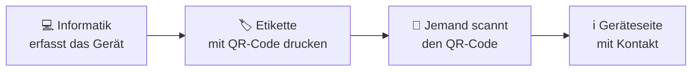

# ICT Lager Campus Sursee

**Die Inventarverwaltung für alle Informatikgeräte von Campus Sursee.**

Die Informatik erfasst hier alle Geräte an einem Ort: Notebooks, Monitore,
Drucker, Netzwerkgeräte und mehr. Jedes Gerät bekommt eine Etikette mit
QR-Code. Wer ein Gerät findet und den Code scannt, sieht sofort, was es ist
und wie der ICT Servicedesk erreichbar ist.

🌐 **<https://ictlager.campus-sursee.ch>**

---

## Schnellzugriff

| | Was | Wofür |
|---|---|---|
| 🌐 | [Startseite](https://ictlager.campus-sursee.ch) | Einstieg in die Anwendung |
| 🔐 | [Verwaltung](https://ictlager.campus-sursee.ch/admin.html) | Geräte erfassen, suchen, Etiketten drucken (nur Informatik) |
| 📋 | [SharePoint: Liste «Geraete»](https://campussursee.sharepoint.com/sites/mgmts-ict-s/Lists/Geraete/AllItems.aspx) | hier liegen die Gerätedaten |
| 🕓 | [SharePoint: Liste «Verlauf»](https://campussursee.sharepoint.com/sites/mgmts-ict-s/Lists/Verlauf/AllItems.aspx) | hier liegt die Chronik aller Änderungen |
| 🗂️ | [SharePoint-Site «mgmts-ict-s»](https://campussursee.sharepoint.com/sites/mgmts-ict-s) | die Site, auf der beide Listen liegen |
| ⚙️ | [Power Automate](https://make.powerautomate.com/environments/Default-2553fb74-5dcc-4072-8bb5-399d18f72af9/flows) | Flow «API Geraet laden» für die öffentliche Geräteseite |
| 🔑 | [Entra ID: App-Registrierung](https://entra.microsoft.com/#view/Microsoft_AAD_RegisteredApps/ApplicationMenuBlade/~/Overview/appId/58384569-7580-4617-ad5c-2bf5a81d397d) | Anmeldung und Berechtigungen |
| 🚀 | [Netlify](https://app.netlify.com) | hier ist die Website abgelegt |

---

## So funktioniert es

1. **Erfassen:** Die Informatik trägt ein Gerät in der Verwaltung ein.
2. **Etikette:** Aus der Verwaltung wird eine Etikette mit QR-Code gedruckt
   und auf das Gerät geklebt.
3. **Scannen:** Wer den QR-Code mit dem Handy scannt, sieht eine kurze
   Geräteseite und die Kontaktangaben des Servicedesks. Ohne Anmeldung.

Jede Änderung an einem Gerät wird automatisch im **Verlauf** festgehalten:
wer hat wann was geändert.

---

## Zwei Bereiche: intern und öffentlich

| | 🔐 Verwaltung | 🌍 Geräteseite |
|---|---|---|
| **Für wen** | Mitarbeitende der Informatik | alle, die einen QR-Code scannen |
| **Anmeldung** | Campus-Sursee-Konto (Microsoft 365) | keine |
| **Sichtbar** | alle Angaben, auch Seriennummer, IP, Owner, Preis, Notizen, Verlauf | nur Name, Kategorie, Status, Hersteller, Modell, Beschreibung |
| **Möglich** | erfassen, ändern, löschen, Etiketten drucken, Dashboard | Servicedesk kontaktieren |

> [!IMPORTANT]
> Interne Angaben (Seriennummer, IP, Preis, Notizen usw.) erscheinen **nie**
> auf der öffentlichen Geräteseite. Nur das Feld **«Beschreibung
> öffentlich»** ist für alle sichtbar, dort also nichts Vertrauliches
> eintragen.

---

## Die Bausteine

Die Anwendung braucht keinen eigenen Server. Sie setzt sich aus Diensten
zusammen, die Campus Sursee ohnehin nutzt:

| Baustein | Aufgabe |
|---|---|
| **Netlify** | liefert die Website aus (reine HTML-Dateien) |
| **SharePoint** | speichert die Daten in zwei Listen: `Geraete` und `Verlauf` |
| **Microsoft Entra ID** | prüft bei der Anmeldung, wer in die Verwaltung darf |
| **Power Automate** | gibt der öffentlichen Geräteseite die wenigen erlaubten Angaben heraus |

---

## Dokumentation

| Dokument | Für wen | Inhalt |
|---|---|---|
| 📘 [Bedienung und Betrieb](anleitung/02_Betrieb.md) | alle in der Informatik | Geräte erfassen, Etiketten drucken, Personen berechtigen, Probleme lösen |
| 🛠️ [Einrichtung](anleitung/01_Einrichtung.md) | Administration | einmalige Einrichtung von Entra ID, SharePoint, Power Automate, Netlify |
| 🧩 [Technische Dokumentation](anleitung/03_Technische_Dokumentation.md) | Entwicklung | Aufbau, Datenmodell, Sicherheit, Code |

**Neu hier?** Mit [Bedienung und Betrieb](anleitung/02_Betrieb.md) beginnen.

---

## Ordner im Repository

| Ordner | Inhalt | Online? |
|---|---|---|
| `frontend/` | die Website, genau so, wie sie auf Netlify liegt | ✅ ja |
| `anleitung/` | diese Dokumentation | ❌ nein |
| `code/` | Hilfsmittel für Tests und eine Sicherungskopie des Flows | ❌ nein |

---

## Kontakt

**ICT Servicedesk Campus Sursee**
✉️ [servicedesk@campus-sursee.ch](mailto:servicedesk@campus-sursee.ch) ·
📞 [+41 41 926 23 69](tel:+41419262369)
