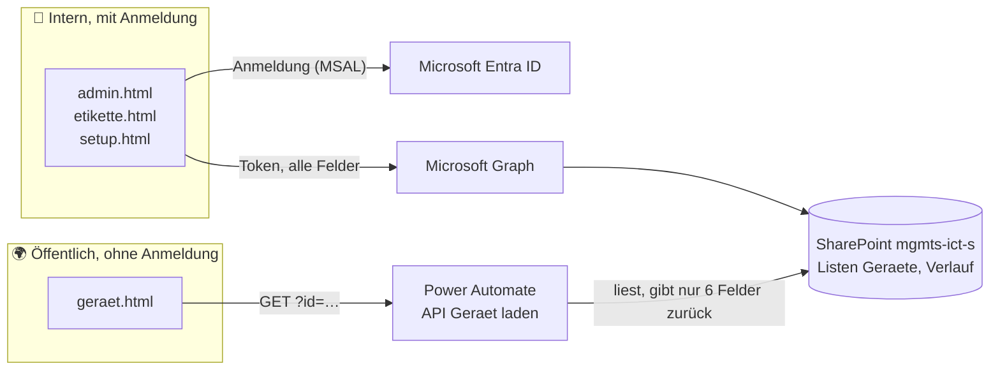

# Technische Dokumentation

Für alle, die am Code arbeiten. Diese Seite erklärt vor allem das **Warum**;
das **Was** steht im Code selbst.

[← zurück zur Übersicht](../README.md)

**Inhalt:**
[1 Überblick](#1-überblick) ·
[2 Architektur](#2-architektur) ·
[3 Datenmodell](#3-datenmodell) ·
[4 Datenzugriff](#4-datenzugriff) ·
[5 Sicherheit](#5-sicherheit) ·
[6 Code](#6-code) ·
[7 Gestaltung](#7-gestaltung) ·
[8 Wartung](#8-wartung) ·
[9 Bekannte Grenzen](#9-bekannte-grenzen)

> [!IMPORTANT]
> **Drei Regeln, die beim Ändern nie verletzt werden dürfen:**
>
> 1. **Fremder Inhalt geht nie über `innerHTML` ins Dokument**, immer über
>    `textContent`. Für den Ausnahmefall gibt es `Hilfe.escape()`.
> 2. **Die öffentliche Seite bekommt nur, was der Flow herausgibt.** Wer ein
>    Feld öffentlich machen will, ändert den Flow, nicht die Seite. Im
>    Browser ausgeblendete Felder sind nicht geschützt, nur unsichtbar.
> 3. **Der Flow baut sein JSON mit `addProperty()`**, nie als
>    zusammengeklebten Text.

---

## 1. Überblick

Die Anwendung besteht aus zwei streng getrennten Welten:



| | Intern | Öffentlich |
|---|---|---|
| Seiten | `admin.html`, `etikette.html`, `setup.html` | `geraet.html` |
| Anmeldung | Entra ID (SSO) | keine |
| Weg zu den Daten | direkt über Microsoft Graph | über den Power-Automate-Flow |
| Sichtbare Felder | alle | sechs |
| Schreiben | ja | nein |

Diese Trennung ist die zentrale Entwurfsentscheidung, siehe
[5. Sicherheit](#5-sicherheit).

---

## 2. Architektur

### 2.1 Rein statische Site

Kein Build-Prozess, kein Framework, keine `node_modules`. Der Ordner
[`frontend/`](../frontend) ist exakt das, was auf Netlify liegt. Das ist
dieselbe Entscheidung wie bei der Anwendung «Menüwahl BAULÜÜT»:

- **Wartbar:** Wer in fünf Jahren etwas ändert, öffnet eine Datei und
  ändert sie, ohne alte Node-Versionen oder Abhängigkeiten.
- **Sicher:** Keine Lieferkette, nur zwei CDN-Dateien mit fester Prüfsumme.
- **Robust:** Ein paar Dateien auf einem CDN, nichts kann abstürzen.

Der Preis: mehr Wiederholung, vor allem im CSS. Bei fünf Seiten lohnt sich
das.

### 2.2 Seiten

Jede Seite enthält ihr HTML, CSS und JavaScript selbst («eine Seite = eine
Datei»). Um `geraet.html` zu verstehen, reicht `geraet.html`.

| Datei | Anmeldung | Zweck |
|---|---|---|
| [`index.html`](../frontend/index.html) | nein | Startseite |
| [`admin.html`](../frontend/admin.html) | ja | Verwaltung: Dashboard, Geräte, Etiketten, Detailansicht |
| [`etikette.html`](../frontend/etikette.html) | ja | Druckansicht der Etiketten |
| [`geraet.html`](../frontend/geraet.html) | **nein** | öffentliche Geräteseite hinter dem QR-Code |
| [`setup.html`](../frontend/setup.html) | ja | einmalige Einrichtung der SharePoint-Listen |

### 2.3 Gemeinsame Dateien

| Datei | Inhalt |
|---|---|
| [`konfig.js`](../frontend/konfig.js) | alle Einstellungen an einem Ort |
| [`auth.js`](../frontend/auth.js) | Anmeldung, dünner Aufsatz auf MSAL |
| [`graph.js`](../frontend/graph.js) | Datenzugriff auf SharePoint plus Hilfsfunktionen |
| [`_headers`](../frontend/_headers) | Sicherheits-Kopfzeilen für Netlify, vor allem die CSP |
| [`_redirects`](../frontend/_redirects) | `/g/:id` → `/geraet.html?id=:id` (kurze Adresse im QR-Code) |
| [`netlify.toml`](../netlify.toml) | `publish = "frontend"`, kein Build-Befehl |
| [`code/serve.ps1`](../code/serve.ps1) | lokaler Testserver, nicht online |
| [`code/flow_api-geraet-laden.json`](../code/flow_api-geraet-laden.json) | Sicherungskopie der Flow-Definition, nicht online |

### 2.4 Fremdbibliotheken

Beide über `cdn.jsdelivr.net`, mit `integrity`-Prüfsumme gepinnt. Ändert
sich die Datei auf dem CDN, lädt der Browser sie nicht.

| Bibliothek | Version | Wofür |
|---|---|---|
| `@azure/msal-browser` | 4.30.0 | Anmeldung (OAuth 2, Code Flow mit PKCE) |
| `qrcode-generator` | 1.4.4 | QR-Codes auf den Etiketten |

Prüfsumme für eine neue Version berechnen:

```bash
curl -sL https://cdn.jsdelivr.net/npm/<paket>@<version>/<datei> \
  | openssl dgst -sha384 -binary | openssl base64 -A
```

Anmeldung und QR-Erzeugung sind bewusst **nicht** selbst gebaut: in beiden
Feldern kann Eigenbau still und leise falsch sein.

---

## 3. Datenmodell

Site: <https://campussursee.sharepoint.com/sites/mgmts-ict-s>

### 3.1 Liste [`Geraete`](https://campussursee.sharepoint.com/sites/mgmts-ict-s/Lists/Geraete/AllItems.aspx)

Ein Eintrag pro Gerät. Die SharePoint-ID ist zugleich die Nummer im
QR-Code.

| Spalte | Typ | Öffentlich |
|---|---|---|
| `Title` (Gerätename) | Text, Pflicht | ✅ |
| `Kategorie` | Auswahl, Pflicht | ✅ |
| `Status` | Auswahl, Pflicht, Vorgabe *Lager* | ✅ |
| `Hersteller` | Text | ✅ |
| `Modell` | Text | ✅ |
| `BeschreibungOeffentlich` | Text, mehrzeilig | ✅ |
| `AssetNr` | Text | |
| `Seriennummer` | Text | |
| `IPAdresse`, `MACAdresse` | Text | |
| `Owner` | Text (Name oder E-Mail) | |
| `Standort` | Text | |
| `Anschaffungsdatum`, `EndOfLife`, `GarantieBis` | Datum ohne Zeit | |
| `Preis` | Zahl, 2 Nachkommastellen (CHF) | |
| `NotizenIntern` | Text, mehrzeilig | |

| Auswahlspalte | Werte |
|---|---|
| `Kategorie` | PC, Notebook, Monitor, Drucker, Netzwerk, Mobile, Peripherie, Server, Sonstiges |
| `Status` | Aktiv, Lager, Reparatur, Ausgemustert |

`Owner` ist bewusst Text und keine Personenspalte: Personenspalten kommen
über Graph als verschachteltes Objekt zurück und lassen sich nicht einfach
befüllen.

### 3.2 Liste [`Verlauf`](https://campussursee.sharepoint.com/sites/mgmts-ict-s/Lists/Verlauf/AllItems.aspx)

Die Chronik. Wird nur ergänzt, nie überschrieben.

| Spalte | Typ | Inhalt |
|---|---|---|
| `Title` | Text | Aktion: «Erstellt», «Geändert», «Gelöscht», «Reparatur», … |
| `GeraetId` | Text | ID aus `Geraete` |
| `Datum` | Datum mit Zeit | |
| `Text` | Text, mehrzeilig | was passiert ist |
| `Wer` | Text | «Anna Muster (anna.muster@campus-sursee.ch)» |

`GeraetId` ist bewusst **keine** Nachschlagespalte (Lookup): diese würde
beim Löschen eines Geräts das Löschen blockieren oder den Verlauf
mitreissen. Der Verlauf soll das Gerät überleben.

### 3.3 Automatische Verlaufseinträge

| Auslöser | Aktion | Text |
|---|---|---|
| Neues Gerät | `Erstellt` | «Gerät angelegt: *Name* (Asset-Nr. …)» |
| Gerät geändert | `Geändert` | pro Feld: «Standort: «Lager 1» → «Raum B12»» (bei langen Textfeldern nur «… geändert») |
| Gerät gelöscht | `Gelöscht` | «Gerät gelöscht: *Name*» |
| Von Hand | frei | frei |

Ohne Unterschied wird nichts geschrieben. Verlaufseinträge laufen über
`Graph.verlaufVersuchen()`: scheitert das Schreiben, gilt die Änderung am
Gerät trotzdem. Die Chronik darf nie der Grund sein, dass eine Änderung
scheitert.

---

## 4. Datenzugriff

Alles läuft über die Fassade in [`graph.js`](../frontend/graph.js). Die
Seiten kennen weder Graph-Pfade noch SharePoint-Feldnamen:

```js
Graph.geraete()                  // alle Geräte, nach Name sortiert
Graph.geraet(id)
Graph.geraetAnlegen(felder)      // -> neue ID
Graph.geraetAendern(id, felder)  // nur die mitgegebenen Felder
Graph.geraetLoeschen(id)
Graph.verlauf(geraetId)          // ohne Argument: alle
Graph.verlaufAnlegen(felder)
Graph.verlaufVersuchen(felder)   // wie oben, scheitert aber nie laut
Graph.listenAnlegen(melden)      // nur für setup.html
```

| Entscheid | Grund |
|---|---|
| **Site-ID zur Laufzeit** aus `sitePfad` auflösen | lesbare Konfiguration statt GUID; Ergebnis wird pro Seite zwischengespeichert |
| Listen als **GUID** in `konfig.js` | überlebt eine Umbenennung in SharePoint (Anzeigename ginge auch) |
| **Immer die ganze Liste laden**, im Browser filtern | Serverseitige Filter auf eigenen Spalten brauchen in SharePoint einen Index und scheitern sonst ab 5000 Einträgen, lange nach der Einführung. Ausnahme: der Flow filtert auf `ID`, die ist immer indiziert. |
| Bei HTTP 400 **ohne `$select` wiederholen** | eine umbenannte Spalte legt die Anwendung nicht lahm |
| Datum lesen mit `Hilfe.datumAusSp()`, schreiben mit `Hilfe.datumFuerSp()` (`T12:00:00Z`) | SharePoint speichert UTC; Mittag UTC liegt in jeder Zeitzone am richtigen Tag. Nur diese zwei Funktionen rechnen mit SharePoint-Zeiten. |
| `Hilfe.wert()` | Auswahlspalten kommen mal als Text, mal als `{Value: …}` |

Die Übersetzung zwischen JavaScript-Feldern (`endOfLife`) und
SharePoint-Spalten (`EndOfLife`) passiert in `ausSp()` und
`felderAusGeraet()`.

---

## 5. Sicherheit

### 5.1 Interne Felder verlassen SharePoint nie

**Die öffentliche Seite spricht nie mit Microsoft Graph.** Sie hat kein
Token und kennt die Site nicht. Der einzige Weg führt über den Flow, und
der baut seine Antwort aus sechs einzeln aufgezählten Feldern. Wer im
Browser den Netzwerkverkehr von `geraet.html` anschaut, sieht genau das,
was auch auf dem Bildschirm steht.

Eine Filterung im Browser wäre keine Filterung, sondern eine optische
Täuschung.

### 5.2 Anmeldung

| Thema | Umsetzung |
|---|---|
| Verfahren | OAuth 2 Authorization Code Flow mit PKCE über MSAL |
| Registrierung | Einzelseitenanwendung (SPA), ohne Client Secret |
| Berechtigungen | delegiert: `Sites.ReadWrite.All`, `User.Read`. Das Token kann nur, was die Person in SharePoint ohnehin darf. |
| Wer darf hinein | Entra entscheidet (*Zuweisung erforderlich = Ja*), nicht das JavaScript. Es gibt keine Rollenlogik, die man umgehen könnte. |
| Zweite Schranke | ohne Zugriff auf die Site «mgmts-ict-s» antwortet Graph mit 403 |
| Token-Ablage | `sessionStorage`, weg beim Schliessen des Tabs; kein `localStorage`, keine Cookies |
| Stille Erneuerung | über ein verstecktes iframe auf `login.microsoftonline.com` (deshalb in der CSP unter `frame-src`) |

`clientId` und `mandantId` stehen offen in `konfig.js`. Das ist bei SPAs so
vorgesehen: es sind Bezeichner, keine Geheimnisse.

### 5.3 Content-Security-Policy

[`_headers`](../frontend/_headers) setzt eine enge CSP mit der Grundhaltung
`default-src 'none'`: erlaubt ist nur, was ausdrücklich aufgeführt ist.

| Richtlinie | Erlaubt |
|---|---|
| `script-src` | eigene Dateien, Inline-Skripte, `cdn.jsdelivr.net` |
| `img-src` | eigene Dateien, `data:`, `www.campus-sursee.ch` (Logo und Favicon) |
| `connect-src` | `graph.microsoft.com`, `login.microsoftonline.com`, `*.environment.api.powerplatform.com` |
| `frame-src` | `login.microsoftonline.com` |
| `frame-ancestors`, `form-action`, `object-src`, `base-uri` | nichts |

`'unsafe-inline'` ist der Preis für «eine Seite = eine Datei». Abgefedert
wird er durch `default-src 'none'`, die Prüfsummen der CDN-Dateien und vor
allem durch Regel 1 (kein `innerHTML`). Nonces gehen nicht, weil eine
statische Site keinen Server hat, der sie erzeugen könnte.

### 5.4 Cross-Site-Scripting

Alles aus SharePoint, aus dem Flow und aus Formularen gilt als fremder Text
und kommt **nur über `textContent`** ins Dokument. Die einzige Ausnahme ist
das SVG von `qrcode-generator`, das nur aus Rechtecken besteht. Auch
CSS-Klassen werden nie direkt aus fremden Werten gebaut: der Status läuft
vorher durch eine feste Tabelle (`geraet.html`) bzw. eine Prüfung gegen
`STATUS` (`admin.html`).

### 5.5 Der anonyme Flow

Der Flow ist absichtlich ohne Anmeldung erreichbar, damit die Geräteseite
von jedem Handy aus geht.

| Frage | Antwort |
|---|---|
| Kann jemand Nummern durchprobieren? | Ja. Er sieht dann die sechs öffentlichen Felder, also etwa das, was auch auf dem Gerät steht. |
| Kann jemand schreiben? | Nein, der Flow kennt nur «Elemente abrufen». |
| Kann jemand interne Felder sehen? | Nein, sie sind nicht Teil der Antwort. |
| Kann jemand den Flow überlasten? | Power Automate drosselt selbst. Ein Ausfall trifft nur die Geräteseite, nicht die Verwaltung. |

Daraus folgt: **`BeschreibungOeffentlich` ist öffentlich.** Alles andere
gehört nach `NotizenIntern`.

Der Aufruf ist ein einfacher CORS-Request (`GET`, keine eigenen
Kopfzeilen), damit der Browser keine `OPTIONS`-Vorabfrage schickt, die der
Flow nicht beantworten würde. Aufbau und Tests des Flows:
[Einrichtung, Schritt C](01_Einrichtung.md#schritt-c-power-automate-flow).

### 5.6 Die Etikette

Nur QR-Code, Logo und `servicedesk@campus-sursee.ch`. Kein Gerätename, keine
Nummer: eine Etikette wird herumgereicht, verliehen und verloren.

---

## 6. Code

### 6.1 `auth.js`

```js
await Auth.anmeldungSicherstellen()  // -> {name, adresse}, oder leitet zu Entra weiter
await Auth.token()                   // -> gültiges Zugriffstoken
Auth.konto()                         // -> {name, adresse} | null
await Auth.abmelden()
```

- Leitet `anmeldungSicherstellen()` weiter, bleibt das zurückgegebene
  `Promise` absichtlich offen. So läuft kein Code mit halb aufgebautem
  Zustand weiter.
- Die Umleitungsadresse ist immer `origin + pathname` ohne `?…`, sonst
  müsste jede Variante in der App-Registrierung stehen.

### 6.2 `graph.js`

| Teil | Inhalt |
|---|---|
| `Hilfe` | Text (`escape`, `wert`), Datum (`datumAusSp`, `datumFuerSp`, `datumKurz`, `zeitpunktText`, `heute`, `inMonaten`), Adressen (`geraetLink`) |
| `KATEGORIEN`, `STATUS` | die Auswahlwerte, einmal definiert und überall verwendet |
| `Graph` | die Fassade aus [Abschnitt 4](#4-datenzugriff), dazu die Spaltendefinitionen und `listenAnlegen()` |

`listenAnlegen()` steht bewusst neben dem Lesen und Schreiben derselben
Spalten. Sie ist wiederholbar: Bestehendes bleibt, Fehlendes wird ergänzt.

### 6.3 `admin.html`

Eine kleine Einzelseitenanwendung: drei Ansichten, umgeschaltet über
`hidden`, dazu eine Detail-Tafel. Kein Router, nur `location.hash`.

Ablauf: `starten()` → `Auth.anmeldungSicherstellen()` → `ladenGeraete()` →
Dashboard, Tabelle und Etiketten zeichnen. Nach jeder Änderung wird neu
geladen, damit kein lokaler Zustand auseinanderläuft.

| Funktion | Zweck |
|---|---|
| `passt(g, suchtext)` | Sofortsuche über Name, Asset-Nr., Seriennummer, IP, MAC, Owner; mehrere Wörter = UND |
| `eolZustand(g)` | `""`, `"bald"` (unter 6 Monaten) oder `"vorbei"`; Vergleich als Text `JJJJ-MM-TT` |
| `unterschiede(alt, neu)` | Text für den Verlaufseintrag |
| `knoten(tag, klasse, text)` | erzeugt Elemente mit `textContent`; der Grund, warum `innerHTML` nie nötig ist |

### 6.4 `etikette.html`

- Aufruf mit `etikette.html?ids=12,13,14`; die IDs werden gegen `\d+`
  geprüft.
- `@page` kennt keine Selektoren, deshalb zwei `<style>`-Blöcke, von denen
  jeweils einer über das `media`-Attribut aktiv ist: Etikettendrucker
  (62 × 29 mm, eine pro Seite) oder A4-Bogen.
- Die Formatwahl merkt sich der Browser in `localStorage` (in `try/catch`).

### 6.5 `geraet.html`

Die einzige Seite ohne Anmeldung und ohne `graph.js`. Mobile-first, weil sie
fast nur per Handy aufgerufen wird.

| Zustand | Meldung |
|---|---|
| keine `id` in der Adresse | «Keine Geräte-Nummer angegeben» |
| `FLOW_GERAET_URL` fehlt | «Die Geräteauskunft ist noch nicht eingerichtet» |
| Anfrage scheitert (offline, CSP, DNS) | «Die Geräteauskunft ist gerade nicht erreichbar» |
| HTTP 404 oder `ok: false` | «Gerät nicht gefunden» |
| anderer HTTP-Fehler | «Die Geräteauskunft antwortet nicht richtig» |

Die Kontaktangaben sind in **jedem** Zustand sichtbar.

---

## 7. Gestaltung

| Thema | Regel |
|---|---|
| Grundsatz | **Reines Weiss, Struktur nur aus Linien.** Keine gefüllten Flächen, keine grauen Hintergründe. |
| Farben | CSS-Variablen in `:root`, in jeder Seite gleich: `--akzent #84B819` (Grün aus dem Logo), `--text #101208`, `--text-2 #5f6359`, `--text-3 #8d9187`, `--linie #e7e8e3`, `--linie-2 #d2d4cc`, `--rot #b03a22` |
| Einzige Fläche | `--tint` (sehr schwaches Grün) für Überfahr- und Auswahlzustände |
| Schrift | Systemschriften, kein Webfont |
| Formen | Radius 10 px an Behältern, 8 px an Bedienelementen, kaum Schatten |
| Navigation | Kopfzeile mit Logo und Konto, darunter Reiter; aktiver Reiter grün unterstrichen |
| Symbole | handgeschriebene SVG-Pfade, kein Icon-Paket |
| Logo, Favicon | direkt von [www.campus-sursee.ch](https://www.campus-sursee.ch) geladen, damit sie dem Corporate Design folgen |
| Sprache | Schweizer Schreibweise: **kein Eszett** (immer «ss») und **keine Gedankenstriche** (Geviert- oder Halbgeviertstrich), weder im Text noch im Code, auch nicht in dieser Dokumentation |

---

## 8. Wartung

**Neue Kategorie oder neuer Status**
In SharePoint den Wert in der Auswahlspalte ergänzen, dann `KATEGORIEN`
bzw. `STATUS` in [`graph.js`](../frontend/graph.js). Auswahlfelder und
Filter bauen sich daraus selbst auf.

**Neue Spalte**

1. [`graph.js`](../frontend/graph.js): Definition in `SPALTEN_GERAETE`,
   Name in `FELDER_GERAET`, Übersetzung in `ausSp()` und
   `felderAusGeraet()`.
2. `setup.html` öffnen und «Listen anlegen» klicken: die Spalte wird in
   SharePoint ergänzt, bestehende Daten bleiben.
3. [`admin.html`](../frontend/admin.html): Bezeichnung in
   `FELD_BEZEICHNUNG` und ein Eingabefeld `f-<name>` im Formular. Lesen,
   Füllen und Verlauf laufen über `FELDER` automatisch mit.
4. Soll das Feld öffentlich sein: zusätzlich den Flow ergänzen (Regel 2).

**MSAL oder qrcode-generator aktualisieren**
Version im `<script>`-Tag ändern **und** die Prüfsumme neu berechnen
([2.4](#24-fremdbibliotheken)). Mit falscher Prüfsumme lädt der Browser die
Datei nicht und die Seite bleibt leer.

**Kontaktangaben ändern**
E-Mail an drei Stellen: `servicedeskMail` in `konfig.js` sowie fest im HTML
von `index.html` und `geraet.html` (damit beide auch ohne JavaScript
vollständig sind). Die Telefonnummer steht nur in den beiden HTML-Dateien.

**Domain ändern**
`BASIS_URL` in `konfig.js` anpassen. Achtung: gedruckte Etiketten zeigen
weiter auf die alte Adresse, eine Umleitung von der alten Domain muss
bestehen bleiben.

---

## 9. Bekannte Grenzen

| Grenze | Auswirkung | Wann sie stört |
|---|---|---|
| Alle Geräte werden bei jedem Laden geholt | ca. 1 bis 2 s bei 1000 Geräten | ab ca. 5000 Geräten |
| `'unsafe-inline'` in der CSP | siehe [5.3](#53-content-security-policy) | wenn eine externe Prüfung es beanstandet |
| Kein gleichzeitiges Bearbeiten | die letzte Speicherung gewinnt | im kleinen ICT-Team praktisch nie |
| Verlauf wird nie aufgeräumt | Liste wächst | erst in Jahren |
| Keine Bilder oder Anhänge | | wenn Fotos gewünscht sind (SharePoint-Anhänge wären der Weg) |
| Nur Deutsch | | |
